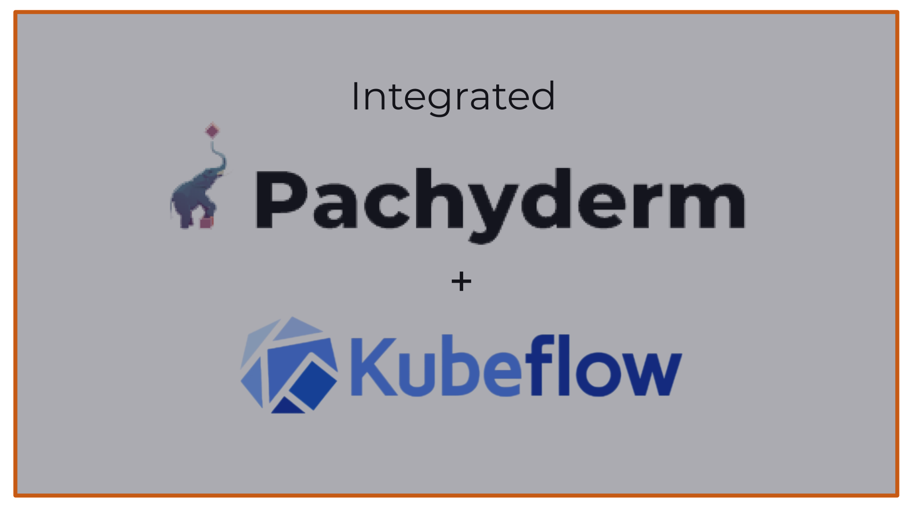
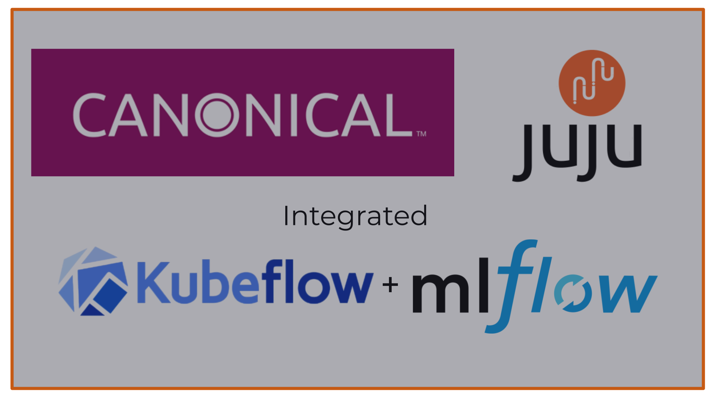
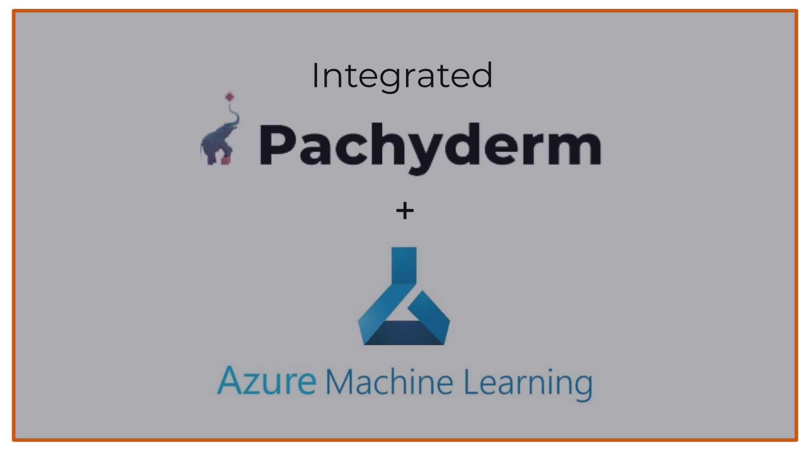
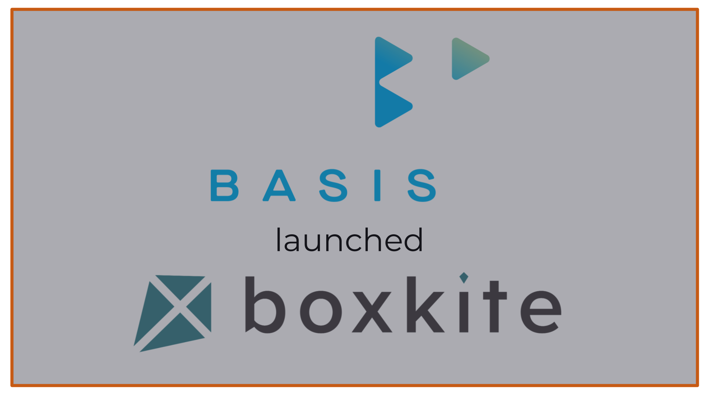
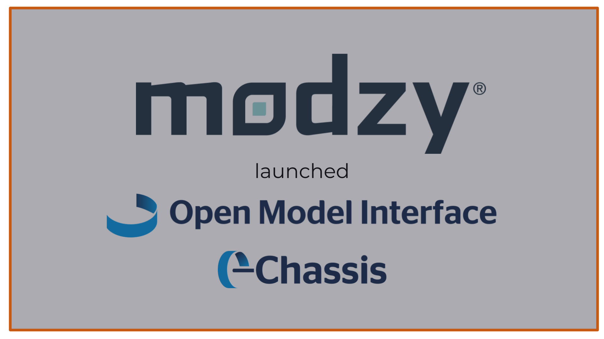
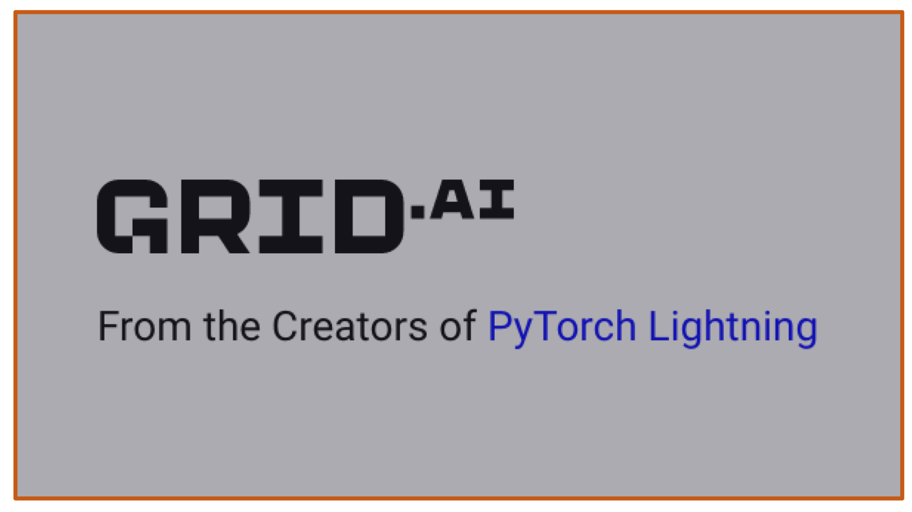

# Hi, we're MLOps Consulting 👋

{ width=500px }

We are Luke, Phil and Kai.
We are LLM and MLOps platform, product and engineering specialists.

## What We Do

We run bespoke projects in LLMs (Large Language Models) and MLOps (DevOps for Machine Learning):

* Developing LLM-powered apps and stacks, such as Legal AI assistants.
* Helping end-user companies evaluate the best MLOps stack for them.
* Integrating MLOps tools together to develop end-to-end MLOps stacks.
* Spinning out open source projects to become MLOps stack components.

## Case Studies

{ width=400px, align=right }

### Legal AI

We are helping a team of lawyers develop novel AI-powered tools to help enterprises and SaaS companies generate more revenue and reduce risk.
In the process we are developing tooling around the OpenAI API as well as vector stores for document search.

{ width=400px, align=right }

### Franchise Cloud

We are helping [Franchise Cloud](https://franchisecloud.io) &mdash; who started with a tech stack for franchisee/franchisor management -- add AI capabilities to their stack for marketing, onboarding and training franchisees, which is revolutionizing their business.

{ width=400px, align=right }

### Intellisense

[Intellisense](https://intellisense.io) is a pioneer in the AI for mining space based in Cambridge, UK.

We helped with user stories and evaluation criteria, tool selection, defining [deployable stacks](https://github.com/combinator-ml) in Terraform, running a series of evaluations, and picking the best platform for their MLOps requirements of heterogeneity, reproducibility & provenance.

{ width=400px, align=right }

### Kubeflow + Pachyderm

[Pachyderm](https://pachyderm.io) is a data versioning, provenance and pipelining startup based in San Francisco.

We helped them integrate Pachyderm with Kubeflow Pipelines, creating the [KFData project](https://github.com/pachyderm/kfdata). We presented a [demo](https://youtu.be/AKO9BtxxYf4) in the Kubeflow Pipelines community meeting.

{ width=400px, align=right }

### MLflow + Kubeflow on Juju

[Canonical](https://canonical.com) is the company behind Ubuntu Linux.

We developed the [MLflow Juju charm](https://github.com/mlopsworks/charms), and worked with their Kubeflow team to integrate it into Kubeflow notebooks so that users can seamlessly log training experiments and models for better reproducibility.

{ width=400px, align=right }

### Azure Machine Learning + Pachyderm

[AzureML](https://azure.microsoft.com/en-gb/services/machine-learning/) is an end-to-end platform for MLOps on the Microsoft Azure cloud.

We worked with the AzureML product team to integrate Pachyderm for immutable data versioning, architecting a Terraform stack and contributing to an internal Microsoft project written in Rust. The solution is in [private preview](https://github.com/pachyderm/aml).

{ width=400px, align=right }

### Boxkite from BasisAI

[BasisAI](https://basis-ai.com/) is an end-to-end MLOps platform company based in Singapore.

We helped them spin out a key component of the open-source MLOps observability stack: [Boxkite](https://boxkite.ml), a lightweight way to solve data & model drift monitoring using Prometheus and Grafana.

We developed a [Kubeflow, MLflow, Prometheus & Grafana stack](https://boxkite.ml/en/latest/tutorials/kubeflow-mlflow/) which showcases Boxkite and can be run from the browser.
We helped them promote it in the press, analyst and MLOps user community.

{ width=400px, align=right }

### Chassis + OMI from Modzy

[Modzy](https://www.modzy.com/) is a model inference platform based out of Washington, DC.

We developed PoCs for model operations, model drift, model evaluation, and automatic model containerization.

We developed the [Open Model Interface](https://openmodel.ml) as a spec for model serving,
and open-sourced [Chassis](https://chassis.ml), the missing link between ML teams and DevOps.
Chassis integrates MLflow with KFServing and Modzy.

{ width=400px, align=right }

### Microsoft's SAME Project

The [SAME Project](https://sameproject.org) is David Aronchick's latest project after he co-founded Kubernetes and Kubeflow at Google.

We added declarative infrastructure support to SAME via [terrachain](https://combinator.ml/terrachain), enabling easy deployment of MLflow alongside Kubeflow Pipelines, enabled metadata auto-logging in the SAME notebook-to-pipeline compiler for better ML governance, and enabled metadata import/export for better collaboration between ML research teams. [Demo](https://youtu.be/e3PXX69kZA8).

{ width=400px, align=right }

### Grid.ai

[Grid.ai](https://grid.ai/) is a company from the creators of the hugely successful [PyTorch Lightning](https://www.pytorchlightning.ai/) project, based in New York.

We helped them develop their DevOps strategy, in particular around massively scalable Kubernetes clusters, and helped prototype tooling for integrating MLOps stacks.

{ width=400px, align=right }

### Combinator and Testfaster

Based on experience end-to-end testing MLOps stacks, we developed foundational technology around [Firecracker](https://github.com/firecracker-microvm/firecracker), the technology that powers AWS Lambda, to declaratively define pools of prewarmed K8s clusters that run on lightweight VMs on bare metal. We called this technology [Testfaster](https://testfaster.ci).

We are applying this technology to power the test drive capability in [Combinator](https://combinator.ml), a project to make it easier to test drive, combine & deploy end-to-end MLOps stacks.

## Who We Are

{ width=200px, align=left }

 

**Luke Marsden, founder and owner of MLOps Consulting**

[Luke](https://lukemarsden.net/about/) is a technical leader and entrepreneur who developed end-to-end MLOps platform company Dotscience.
He was Kubernetes SIG lead for cluster-lifecycle, creating [kubeadm](https://kubernetes.io/blog/2016/09/how-we-made-kubernetes-easy-to-install/) with Joe Beda, and worked on Docker plugins with Solomon Hykes.

{ width=200px, align=left }

 

**Phil Winder, associate, and founder of [Winder.ai](https://winder.ai/)**

Phil is one of those rare people who deeply understands both the mathematics of ML and the software engineering best practice of DevOps and MLOps.
He wrote the book on [Reinforcement Learning](https://rl-book.com/).

{ width=200px, align=left  }

 

**Kai Davenport, associate senior engineer**

Kai is an extremely sharp software engineer who can develop high quality MLOps software and integrations at speed. He is proficient in Python, Golang and more.

## Principles

We see a future where AI/ML is pervasive throughout every industry, and sophisticated technology teams assemble their MLOps platform from a set of best-of-breed components, just like how software & DevOps teams do today.

The projects we take on are generally aligned around furthering and making it easier to integrate these best-of-breed components into full end-to-end MLOps stacks that enable better productivity & governance for ML & MLOps teams.

We believe in applying the best practices of software engineering & DevOps to the MLOps space, where they are sorely lacking in common practice today.

Reproducibility, provenance, CI/CD, GitOps, observability and version control are all things that software & DevOps teams take for granted.

For AI/ML to emerge from research and deliver true business value, the same problems must be solved for data & ML.

## Get in Touch

Interested in scoping out a project?

Drop Luke an email on [luke@mlops.consulting](mailto:luke@mlops.consulting) or come chat to Luke Marsden on the [MLOps.community Slack](https://mlops.community).

We'll jump on a video call to explore how we can help, then work together to develop a proposal.

 
